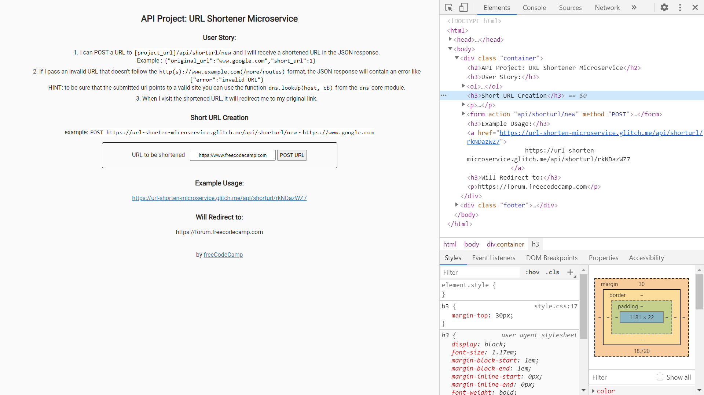
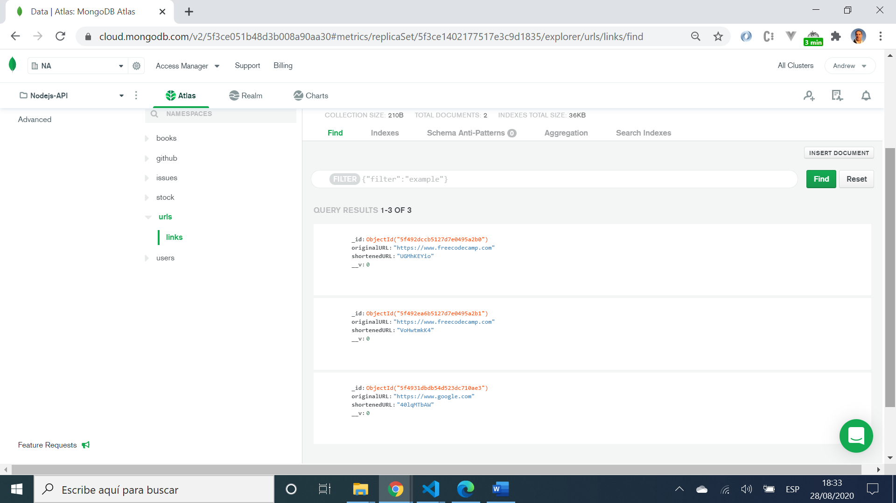

# :zap: URL Shortener Microservice for freeCodeCamp

* Creates a url short ID and stores it in a database with the original url
* Adding the shortID in a url address will redirect to the original website
* This was part of the FreeCodeCamp exercises for Front End Certification
* Note: mLab MongoDB Heroku add-on has been shut down - suggest MongoDB Atlas (free tier) is used instead
* **Note:** to open web links in a new window use: _ctrl+click on link_


## :page_facing_up: Table of contents

* [:zap: URL Shortener Microservice for freeCodeCamp](#zap-url-shortener-microservice-for-freecodecamp)
  * [:page_facing_up: Table of contents](#page_facing_up-table-of-contents)
  * [:books: General info](#books-general-info)
  * [:camera: Screenshots](#camera-screenshots)
  * [:signal_strength: Technologies](#signal_strength-technologies)
  * [:floppy_disk: Setup](#floppy_disk-setup)
  * [:computer: Code Examples](#computer-code-examples)
  * [:cool: Features](#cool-features)
  * [:clipboard: Status & To-Do List](#clipboard-status--to-do-list)
  * [:clap: Inspiration](#clap-inspiration)
  * [:file_folder: License](#file_folder-license)
  * [:envelope: Contact](#envelope-contact)

## :books: General info

* Original instructions (User Stories) from FCC:

_1. I can POST a URL to `[project_url]/api/shorturl/new` and I will receive a shortened URL in the JSON response. Example : `{"original_url":"www.google.com","short_url":1}`
2. If I pass an invalid URL that doesn't follow the valid `http(s)://www.example.com(/more/routes)` format, the JSON response will contain an error like `{"error":"invalid URL"}`. *HINT*: to be sure that the submitted url points to a valid site you can use the function `dns.lookup(host, cb)` from the `dns` core module.
3. When I visit the shortened URL, it will redirect me to my original link.
4. `[this_project_url]/api/shorturl/3` will redirect to `http://forum.freecodecamp.com`_

* MongoDB Cloud Atlas database set up to use Google Cloud Storage.
* Example: POST [project_url]/api/shorturl/new - body (urlencoded) :  url=`https://www.google.com`

## :camera: Screenshots

.
.

## :signal_strength: Technologies

* [Node v12](https://nodejs.org/en/) javaScript runtime built on Chrome's V8 JavaScript engine
* [Express v5](https://expressjs.com/) Fast, unopinionated, minimalist web framework for Node.js
* [MongoDB Atlas](https://www.mongodb.com/cloud/atlas) cloud-based NoSQL database
* [mongoose v5](https://mongoosejs.com/) object modelling for node.js.
* [dbs v0.2.2](https://www.npmjs.com/package/dns) DNS Server with a web UI and Redis configuration store
* [shortid v2](https://www.npmjs.com/package/shortid) to generate short non-sequential url-friendly unique ids
* [Cors v2](https://www.npmjs.com/package/cors) node.js package for providing Connect/Express middleware that can be used to enable CORS with various options.

## :floppy_disk: Setup

* Create MongoDB Atlas Cloud database (or local installed MongoDB database) and add user access/database credentials (USER_NAME, USER_PASSWORD, DB_CLUSTER, PORT, DB_NAME & SESSION_SECRET) to a new `.env` file. These are used in `server.js`.
* Add your IP address to MongoDB Atlas Network Access whitelist. Or simply whitelist all (IP address 0.0.0.0/0).
* Run `node server.js` for a dev server. Navigate to `http://localhost:4000/`.
* The app will not automatically reload if you change any of the source files.

## :computer: Code Examples

* extract from `server.js` to check url is valid then generate short url using npm shortid module then save both in database

```javascript
//use dns lookup function to check url is valid
dns.lookup(parsedURL.host, (err, address) => {
	if (address === undefined) {
		res.json({
			error:
			'This url failed the formatting test - check and try again. ' +
			err,
		});
	} else {
		const data = new shortURL({
			originalURL: prependHttp(originalURL),
			shortenedURL: shortid.generate(),
		});
		console.log(data);

		data.save((err) => {
			if (err) {
				console.log(err);
				return res.send('error: unable to save to database');
			}
				console.log('all OK');
		});
		res.send(data);
	}
});
```

## :cool: Features

* Common MongoDB Atlas Cloud connection method used to save a lot of time with multiple projects.

## :clipboard: Status & To-Do List

* Status: Working. Nothing to stop the same url being saved in the database multiple times with different shortIDs.
* To-Do: add a check to prevent duplicate websites having different shortIDs in the database. Replace var with const & let

## :clap: Inspiration

* [freeCodeCamp's APIs and Microservices Projects - URL Shortener Microservice](https://www.freecodecamp.org/learn/apis-and-microservices/apis-and-microservices-projects/url-shortener-microservice)

## :file_folder: License

* This project is licensed under the terms of the MIT license.

## :envelope: Contact

* Repo created by [ABateman](https://github.com/AndrewJBateman), email: gomezbateman@yahoo.com
